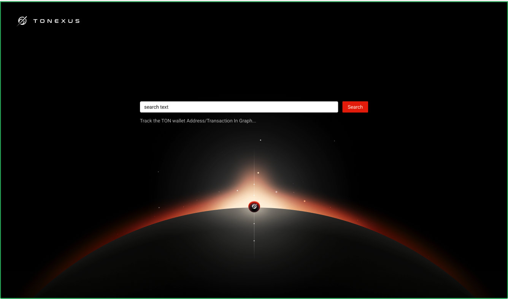
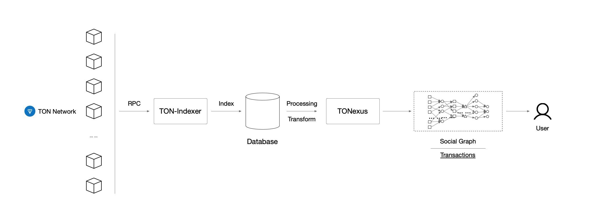

# TONEXUS
---


## Introduction
---

TONexus is a project that aims to build a wallet social map to visualize how the wallet interact with others. and also show the transaction details to the user;

It will represent the `wallet` as a node in the graph, and the transaction as the edge between the nodes. The node will be colored by the type of the wallet, and the edge will be colored by the type of the transaction. The transaction could be a `payment`, `transfer`, `deposit`, `withdraw`, `exchange`, `airdrop`, `staking`, `reward`, `refund`, `burn`, `mint`, `other` and so on.
We could also switch the view in Graph or Flow which could help you understand how the wallets(People) iteract with each others in TON Network(Sociaty)



## Installation
---

Install the Python libraries follow the commands below

```
pip install -r ./requirements.pip
```

## Getting Started
---

### Run the Web server


You could run the Web Server through the following commands 

```
python run ./manager.py
```

### Launch the Visualization Frontend

When the Web Server run successfully, you could launch the visualization frontend through the following commands


<TODO: Add frontend launch command>


## Architecture
---

The Project is composed of the following components. We will demostrate the architecture in the following picture.




## Project Layout
---

Here the project layout and the description of each file or directory.

```
├── README.md
├── docker                 // docker-compose file to build the docker image and run container
│   └── docker-compose.local.yml
├── docs
│   └── pics
├── manager.py             // Run the WebServer
├── requirements.pip
├── tests                  // Unittests for business
│   ├── __init__.py
│   ├── data
│   ├── factories
│   ├── fixtures
│   └── managers
├── tonexus                // The project directory
│   ├── __init__.py
│   ├── __pycache__
│   ├── app.py
│   ├── config.py
│   ├── decorators.py
│   ├── exceptions.py
│   ├── ext.py
│   ├── libs.py
│   ├── loggers.py
│   ├── managers.py
│   ├── models.py          // Models migrated from the ton-indexer which would used to query and fetch represent in Graph/Flow node
│   ├── response.py
│   ├── routes.py
│   ├── schemas.py
│   ├── utils.py
│   └── views.py
```

## Tests & Contributes
---

You could run the unittests through the following commands

```
env PYTHONPATH=. pytest ./tests
```
